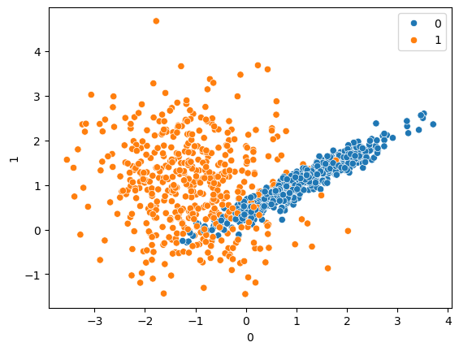

# 🧠 Support Vector Classification (SVC) Implementation


---

# 📌 Project Overview

This project demonstrates the implementation of **Support Vector Classification (SVC)** using Python and Scikit-Learn.

Support Vector Machines (SVMs) are powerful supervised machine learning algorithms used for solving classification problems.

The project includes:
- Data preprocessing
- Model training
- Multiple kernel implementation
- Prediction on unseen data
- Classification evaluation
- Understanding decision boundaries and kernel behavior

---

# 🔥 Features

- Binary classification
- Support Vector Classification implementation
- Multiple kernel implementation
- Non-linear classification
- Prediction on unseen data
- Classification metrics evaluation
- Confusion Matrix analysis
- Data visualization

---

# 📂 Dataset Information

The dataset is generated using Scikit-Learn's synthetic dataset generator for binary classification tasks.

| Feature | Description |
|----------|-------------|
| X | Input Features |
| y | Target Labels |

### Dataset Details

- Number of samples: 1000
- Number of features: 2
- Number of target classes: 2
- Synthetic classification dataset

---

# 🤔 Why SVM?

Support Vector Machines are highly effective for both linear and non-linear classification problems.

SVM attempts to find the optimal hyperplane that separates classes with maximum margin.

Advantages:
- Effective for classification tasks
- Handles high-dimensional data well
- Works effectively with non-linear data
- Uses kernels for complex decision boundaries
- Robust against overfitting in many cases

---

# ⚙️ Workflow

1. Import libraries
2. Generate dataset
3. Visualize dataset
4. Apply Train-Test Split
5. Train SVC model
6. Apply different kernels
7. Predict test data
8. Evaluate model performance

---

# 🔄 Project Workflow Diagram

Dataset → Visualization → Train-Test Split → SVC Training → Kernel Application → Prediction → Evaluation

---

# 🛠️ Tech Stack

- Python
- NumPy
- Pandas
- Matplotlib
- Seaborn
- Scikit-Learn
- Jupyter Notebook

---

# 📐 SVM Concept

Support Vector Machines classify data by creating optimal decision boundaries between classes.

The algorithm mainly focuses on:
- Support vectors
- Hyperplanes
- Margin maximization

For non-linear data, kernel functions transform feature spaces for better class separation.

---

# 📊 Data Visualization

The dataset visualization helps understand class separation and decision boundaries.

## Dataset Visualization



---

# 🔗 Kernels Implemented

## 1️⃣ Linear Kernel

Used when data is linearly separable.

## 2️⃣ RBF Kernel

Handles non-linear classification problems effectively.

## 3️⃣ Polynomial Kernel

Creates curved decision boundaries.

## 4️⃣ Sigmoid Kernel

Provides neural-network-like behavior.

---

# ⚙️ Model Training

The model is trained using Scikit-Learn's SVC implementation.

```python
from sklearn.svm import SVC

svc = SVC(kernel='rbf')

svc.fit(X_train, y_train)
```

---

# 📏 Model Evaluation

The model performance is evaluated using:

- Accuracy Score
- Confusion Matrix
- Classification Report
- Precision
- Recall
- F1 Score

These metrics help evaluate classification accuracy and prediction quality.

---

# 📊 Results

The SVC model successfully classified the dataset and generated predictions on unseen test data.

Different kernels demonstrated different classification behaviors and decision boundaries.

The evaluation metrics helped analyze prediction accuracy and model performance.

---

# 🔍 Key Insights

- SVM works effectively for binary classification tasks.
- Kernel functions help classify non-linear datasets.
- Different kernels create different decision boundaries.
- Visualization helps understand classification behavior clearly.
- Evaluation metrics help measure classification quality.

---

# ⚠️ Challenges Faced

- Understanding SVM concepts
- Understanding support vectors and hyperplanes
- Kernel selection
- Visualizing decision boundaries
- Interpreting classification metrics
- Understanding non-linear classification

---

# 🚀 Future Improvements

- Hyperparameter tuning using GridSearchCV
- Cross-validation
- Real-world classification datasets
- Multi-class classification
- Compare with Logistic Regression
- Deploy using Flask or Streamlit

---

# 📚 What I Learned

- Support Vector Machine concepts
- Binary classification workflow
- Kernel functions
- Decision boundaries
- Classification metrics
- Data visualization
- Machine learning model evaluation

---

# 👩‍💻 Author

Karra Harshita  
B.Tech ETC Student