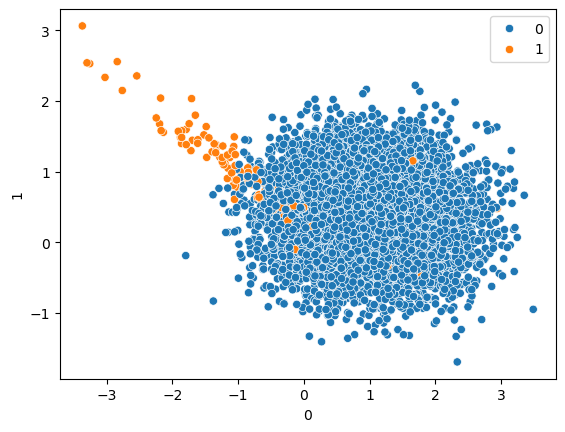

# 📊 Logistic Regression Implementation

---

# 📌 Project Overview

This project demonstrates the implementation of **Logistic Regression** using Python and Scikit-Learn.

The model is trained on a classification dataset to predict target classes using supervised machine learning techniques.

The project also includes preprocessing, feature scaling, prediction, and evaluation of classification performance.

---

# 🔥 Features

- Data preprocessing
- Feature scaling
- Train-test splitting
- Logistic Regression model training
- Prediction on unseen data
- Classification metrics evaluation
- Confusion Matrix analysis
- Classification Report generation

---

# 📂 Dataset Information

The dataset contains input features and target labels for binary classification.

| Feature | Description |
|----------|-------------|
| X | Independent Features (Input) |
| y | Target Labels (Output) |

---

# 🤔 Why Logistic Regression?

Logistic Regression is one of the most commonly used machine learning algorithms for binary classification tasks.

The algorithm predicts probabilities and classifies outputs into categories such as:
- 0 → Negative Class
- 1 → Positive Class

It is simple, efficient, interpretable, and performs well on classification problems.

---

# ⚙️ Workflow

1. Import dataset
2. Data preprocessing
3. Train-test splitting
4. Feature scaling
5. Train Logistic Regression model
6. Predict output values
7. Evaluate model performance

---

# 🔄 Project Workflow Diagram

Dataset → Preprocessing → Train-Test Split → Feature Scaling → Model Training → Prediction → Evaluation

---

# 🛠️ Tech Stack

- Python
- NumPy
- Pandas
- Matplotlib
- Scikit-Learn
- Jupyter Notebook
- Seaborn

---

# 📐 Logistic Regression Concept

Logistic Regression is a supervised machine learning algorithm used for classification tasks.

The model predicts probabilities and classifies data points into categories based on input features.

---

# 📊 Visualization

Visualization of Synthetic Imbalanced Dataset

---

# 📏 Model Evaluation

The model performance is evaluated using:

- Accuracy Score
- Confusion Matrix
- Classification Report
- Precision
- Recall
- F1 Score

These metrics help measure classification accuracy and prediction quality.

---

# 📊 Results

The Logistic Regression model successfully classified the dataset and generated predictions on unseen test data.

The evaluation metrics demonstrated effective classification performance and helped analyze prediction quality.

---

# 🔍 Key Insights

- Logistic Regression works effectively for binary classification tasks.
- Feature scaling improves model performance.
- Classification metrics help analyze prediction quality.
- Confusion Matrix helps understand classification errors.
- Proper preprocessing improves overall accuracy.

---

# ⚠️ Challenges Faced

- Understanding classification metrics
- Understanding confusion matrix
- Feature scaling implementation
- Model evaluation analysis
- Interpreting prediction results

---

# 🚀 Future Improvements

- Hyperparameter tuning
- Cross-validation
- Real-world datasets
- Multi-class classification
- Compare with advanced classification algorithms
- Deploy using Flask or Streamlit

---

# 📚 What I Learned

- Logistic Regression concepts
- Binary classification workflow
- Feature scaling
- Train-test splitting
- Classification metrics
- Confusion Matrix interpretation
- Machine learning model evaluation

---

# 👩‍💻 Author

Karra Harshita  
B.Tech ETC Student