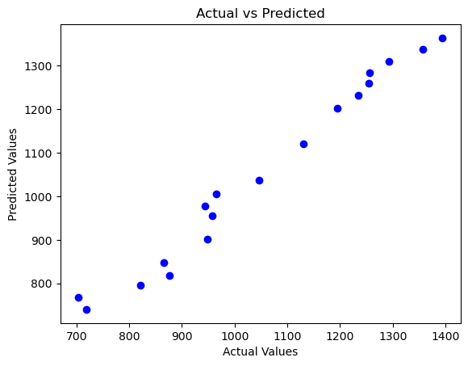

# 📊 Multiple Linear Regression — Economic Index Prediction

---

# 📌 Project Overview

This project demonstrates the implementation of **Multiple Linear Regression** using Python and Scikit-Learn.

The model predicts the target variable using multiple economic indicators and analyzes how different features influence the output.

The project focuses on:
- Data preprocessing
- Multiple feature handling
- Model training
- Prediction
- Regression analysis
- Visualization and interpretation

---

# 🔥 Features

- Data preprocessing
- Multiple feature input handling
- Train-test splitting
- Multiple Linear Regression model training
- Prediction and analysis
- Understanding feature relationships
- Model evaluation

---

# 📂 Dataset Information

The dataset contains economic index-related features used for prediction.

Example features may include:

| Feature | Description |
|----------|-------------|
| Interest Rate | Economic interest rate |
| Unemployment Rate | Percentage of unemployment |
| Stock Index Price | Target variable/output |

---

# 🤔 Why Multiple Linear Regression?

Multiple Linear Regression is useful when the output depends on multiple input variables.

Instead of using a single feature, the model learns relationships between several economic indicators and predicts the target value more accurately.

---

# ⚙️ Workflow

1. Import dataset
2. Data preprocessing
3. Feature selection
4. Train-test split
5. Train Multiple Linear Regression model
6. Predict output values
7. Analyze feature relationships
8. Evaluate model performance

---

# 🔄 Project Workflow Diagram

Dataset → Preprocessing → Feature Selection → Train-Test Split → Model Training → Prediction → Evaluation

---

# 🛠️ Tech Stack

- Python
- NumPy
- Pandas
- Matplotlib
- Scikit-Learn
- Jupyter Notebook
- Seaborn

---

# 📐 Regression Equation

y = b₀ + b₁x₁ + b₂x₂ + ... + bₙxₙ

Where:

- y → Predicted output
- b₀ → Intercept
- b₁, b₂ ... → Coefficients
- x₁, x₂ ... → Input features

---

# 📊 Visualization

The model learns relationships between multiple economic indicators and the target variable.

Visualizations help understand:
- Feature relationships
- Trends in data
- Prediction behavior

## Output Visualization

---

# 📏 Model Evaluation

The model performance can be evaluated using:

- Mean Squared Error (MSE)
- R² Score

These metrics help measure prediction accuracy and regression performance.

---

# 📊 Results

The model successfully learned relationships between economic indicators and predicted the target variable using Multiple Linear Regression.

---

# 🔍 Key Insights

- Multiple features influence the output simultaneously.
- Economic indicators can show strong relationships with prediction targets.
- Multiple Linear Regression improves prediction capability compared to single-feature regression.
- Feature importance helps understand model behavior.

---

# ⚠️ Challenges Faced

- Handling multiple input features
- Understanding feature relationships
- Data preprocessing
- Model interpretation
- Visualizing multidimensional data

---

# 📁 Project Structure

multiple-linear-regression/
│
├── data/
│   └── economic_index.csv
│
├── notebook/
│   └── Multiple_Linear_Regression.ipynb
│
├── images/
│   └── mlr_plot.png
│
└── README.md

---

# 🚀 Future Improvements

- Use larger real-world economic datasets
- Perform feature engineering
- Compare with Ridge and Lasso Regression
- Deploy using Streamlit or Flask
- Add advanced visualization techniques

---

# 📚 What I Learned

- Working of Multiple Linear Regression
- Feature handling in machine learning
- Data preprocessing
- Model training and prediction
- Feature relationship analysis
- Model evaluation techniques

---

# 👩‍💻 Author

Karra Harshita  
B.Tech ETC Student