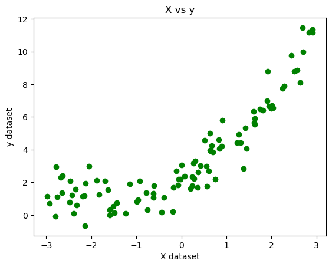
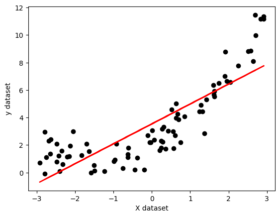
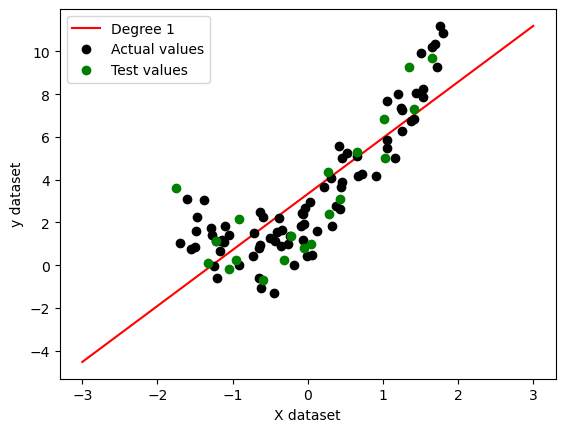
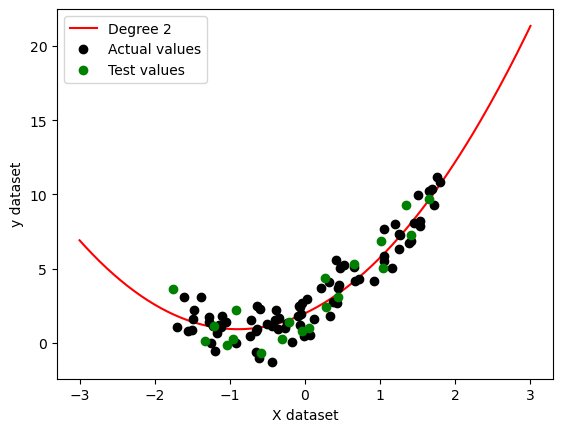
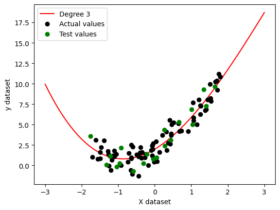
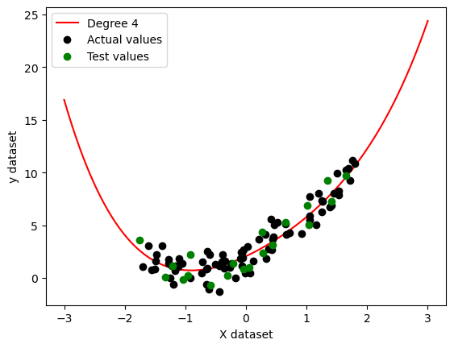

# 📈 Polynomial Regression with Pipeline Implementation

---

# 📌 Project Overview

This project demonstrates the implementation of **Polynomial Regression** using Python and Scikit-Learn.

Unlike Simple Linear Regression, Polynomial Regression is capable of learning **non-linear relationships** between variables by transforming input features into polynomial terms.

The project also includes **Scikit-Learn Pipelines** for building cleaner and more efficient machine learning workflows.

---

# 🔥 Features

- Non-linear data modeling
- Polynomial feature transformation
- Pipeline implementation
- Model training and prediction
- Regression curve visualization
- Understanding curve fitting
- Workflow optimization using pipelines

---

# 📂 Dataset Information

The dataset contains artificially generated values showing a non-linear relationship between variables.

| Feature | Description |
|----------|-------------|
| X | Independent Variable (Input) |
| y | Dependent Variable (Output) |

---

# 🤔 Why Polynomial Regression?

Simple Linear Regression can only fit straight lines.

However, many real-world datasets contain curved or non-linear patterns.

Polynomial Regression transforms input features into higher-degree polynomial terms, allowing the model to capture complex relationships more effectively.

---

# ⚙️ Workflow

1. Import libraries
2. Generate dataset
3. Visualize dataset
4. Apply Polynomial Feature Transformation
5. Train Polynomial Regression model
6. Predict output values
7. Visualize regression curve
8. Evaluate model performance

---

# 🔄 Project Workflow Diagram

Dataset → Polynomial Feature Transformation → Pipeline → Model Training → Prediction → Visualization

---

# 🛠️ Tech Stack

- Python
- NumPy
- Pandas
- Matplotlib
- Scikit-Learn
- Jupyter Notebook
- Seaborn

---

# 📐 Polynomial Regression Equation

y = b₀ + b₁x + b₂x² + b₃x³ + ... + bₙxⁿ

Where:

- y → Predicted output
- x → Input feature
- b₀ → Intercept
- b₁, b₂ ... → Polynomial coefficients

---

# 📊 Dataset Visualization

The dataset shows a clear non-linear relationship between input and output values.

---

# 📈 Polynomial Curve Fitting

The Polynomial Regression model learns curved relationships more effectively than a straight regression line.

---

# 🔗 Pipeline Implementation

The project also demonstrates the use of **Scikit-Learn Pipelines** for building cleaner and more efficient machine learning workflows.

The pipeline automates:

- Polynomial feature transformation
- Linear Regression model training
- Prediction workflow

Using pipelines helps:

- Reduce repetitive code
- Improve readability
- Simplify preprocessing and model building
- Make experimentation easier

---

# ⚙️ Pipeline Components

- PolynomialFeatures
- LinearRegression
- Pipeline

---
# 📊 Polynomial Degree Comparison

The project also compares Polynomial Regression models with different polynomial degrees to understand model flexibility and curve fitting behavior.

Higher polynomial degrees increase model complexity and can improve fitting, but very high degrees may lead to overfitting.

---
## Degree Comparison Visualization

---
# 📏 Model Evaluation

The model performance can be evaluated using:

- Mean Squared Error (MSE)
- R² Score

These metrics help measure prediction accuracy and curve fitting performance.

---

# 📊 Results

The Polynomial Regression model successfully captured the non-linear relationship between input and output values and generated smooth curve fitting for the dataset.

---

# 🔍 Key Insights

- Real-world datasets are often non-linear.
- Polynomial Regression helps model curved relationships effectively.
- Higher-degree polynomial terms improve model flexibility.
- Pipelines simplify machine learning workflows.
- Visualization helps understand model behavior clearly.

---

# ⚠️ Challenges Faced

- Understanding polynomial feature transformation
- Choosing suitable polynomial degree
- Avoiding overfitting
- Visualizing regression curves
- Understanding pipeline workflows

---

# 📁 Project Structure

polynomial-regression/
│
├── data/
│   └── dataset.csv
│
├── notebook/
│   └── Polynomial_Regression.ipynb
│
├── images/
│   ├── polynomial_regression_plot.png
│   └── polynomial_curve.png
│
└── README.md

---

# 🚀 Future Improvements

- Experiment with higher polynomial degrees
- Compare with Linear Regression
- Apply Ridge and Lasso Regularization
- Use real-world datasets
- Deploy using Streamlit or Flask

---

# 📚 What I Learned

- Polynomial Regression concepts
- Non-linear data modeling
- Polynomial feature transformation
- Pipeline implementation
- Curve fitting visualization
- Machine learning workflow optimization

---

# 👩‍💻 Author

Karra Harshita  
B.Tech ETC Student