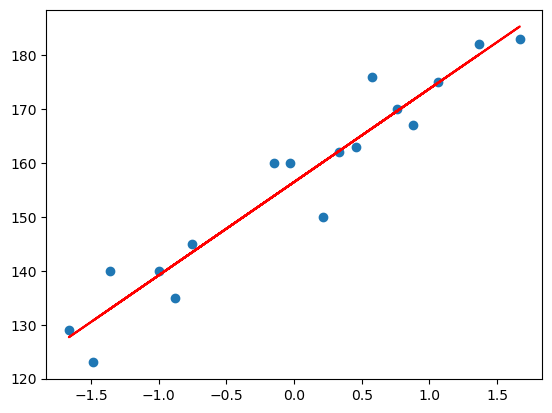

# 📈 Simple Linear Regression — Weight vs Height

---

# 📌 Project Overview

This project demonstrates the implementation of **Simple Linear Regression** using Python and Scikit-Learn.

The model predicts **Height** based on **Weight** using supervised machine learning techniques and visualizes the relationship using a regression line.

---

# 🔥 Features

- Data preprocessing
- Train-test splitting
- Simple Linear Regression model training
- Prediction and visualization
- Regression line plotting
- Understanding linear relationships

---

# 📂 Dataset Information

The dataset contains two columns:

| Feature | Description |
|----------|-------------|
| Weight | Independent Variable (Input) |
| Height | Dependent Variable (Output) |

---

# 🤔 Why Linear Regression?

Linear Regression is suitable for this problem because weight and height generally show a continuous linear relationship.

The algorithm tries to find the best-fit line that minimizes prediction error and helps predict numerical values efficiently.

---

# ⚙️ Workflow

1. Import dataset
2. Data preprocessing
3. Split dataset into training and testing sets
4. Train Simple Linear Regression model
5. Predict output values
6. Visualize regression line
7. Evaluate model performance

---

# 🔄 Project Workflow Diagram

Dataset → Preprocessing → Train-Test Split → Model Training → Prediction → Visualization

---

# 🛠️ Tech Stack

- Python
- NumPy
- Pandas
- Matplotlib
- Scikit-Learn
- Jupyter Notebook
- Seaborn

---

# 📐 Regression Equation

y = mx + c

Where:

- y → Predicted Height
- x → Weight
- m → Slope
- c → Intercept

---

# 📊 Visualization

The regression line shows the relationship between weight and height.

- As weight increases, height also tends to increase.
- The model learns this relationship from the dataset.

## Regression Plot

---

---

# 📏 Model Evaluation

The model performance can be evaluated using:

- Mean Squared Error (MSE)
- R² Score

These metrics help measure prediction accuracy and model performance.

---

# 📊 Results

The model successfully learned the relationship between weight and height and predicted output values using the regression line.

---

# 🔍 Key Insights

- Weight and height show a positive linear relationship.
- Linear Regression works well for continuous numerical prediction.
- Visualization helps in understanding model behavior clearly.
- Regression lines help identify trends in data.

---

# ⚠️ Challenges Faced

- Understanding train-test splitting
- Data preprocessing
- Visualizing regression results
- Interpreting regression output

---

# 📁 Project Structure

simple-linear-regression/
│
├── data/
│   └── height-weight.csv
│
├── notebook/
│   └── Simple_Linear_Regression.ipynb
│
├── images/
│   └── regression_plot.png
│
└── README.md

---

# 🚀 Future Improvements

- Use larger real-world datasets
- Compare with Polynomial Regression
- Add advanced evaluation metrics
- Deploy using Flask or Streamlit

---

# 📚 What I Learned

- Basics of supervised learning
- Working of Linear Regression
- Data preprocessing
- Train-test splitting
- Data visualization
- Model prediction workflow

---

# 👩‍💻 Author

Karra Harshita  
B.Tech ETC Student